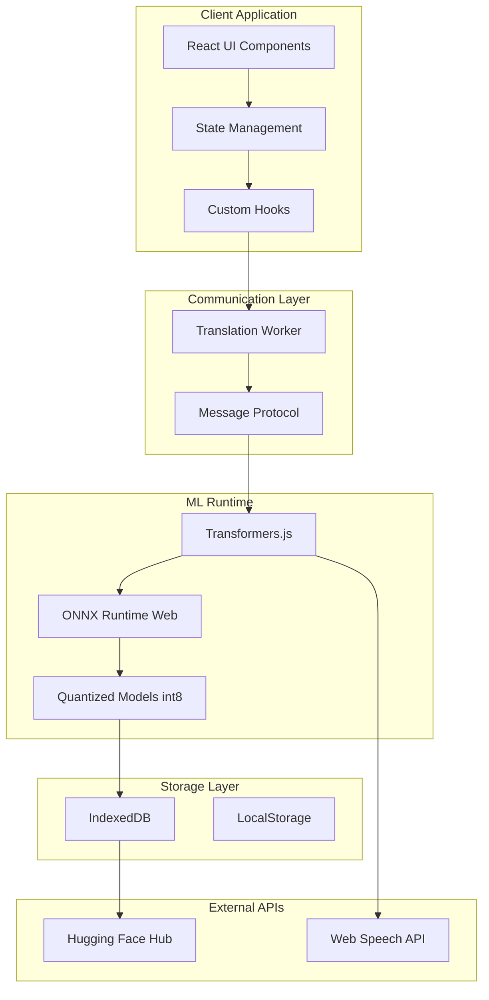

# Ingenious Translate - Architectural Plan

## Executive Summary

This architectural plan outlines the implementation of text translation functionality for the Ingenious Translate application, leveraging **transformers.js** for on-device translation, **Web Workers** for performance, **IndexedDB** for model caching, and the existing **React/Tailwind/RBUI** stack.

---

## 1. System Architecture Overview



---

## 2. Directory Structure

```
src/
├── components/
│   ├── translator/
│   │   ├── TranslationPanel.tsx      # Main translation interface
│   │   ├── LanguageSelector.tsx       # Source/Target language dropdowns
│   │   ├── TextInput.tsx              # Source text input area
│   │   ├── TextOutput.tsx             # Translated text display
│   │   ├── TranslateButton.tsx        # Action button with loading state
│   │   ├── StatusIndicator.tsx         # Progress/progress bar component
│   │   ├── ModelManager.tsx            # Model cache management UI
│   │   ├── TTSSpeaker.tsx             # Text-to-Speech button
│   │   └── CopyButton.tsx              # Copy to clipboard
│   │
│   └── ui/
│       └── (existing components)
│
├── hooks/
│   ├── useTranslation.ts              # Main translation hook
│   ├── useModelLoader.ts               # Model loading hook
│   ├── useTTS.ts                       # Text-to-Speech hook
│   └── useWorker.ts                    # Web Worker communication hook
│
├── lib/
│   ├── translation/
│   │   ├── worker.ts                  # Web Worker setup
│   │   ├── protocol.ts                 # Message protocol definitions
│   │   ├── models.ts                   # Model configuration
│   │   └── languages.ts               # Supported languages
│   │
│   ├── storage/
│   │   ├── indexeddb.ts               # IndexedDB wrapper for models
│   │   └── preferences.ts             # User preferences storage
│   │
│   └── tts/
│       ├── browser.ts                 # Web Speech API wrapper
│       └── engine.ts                  # TTS engine interface
│
├── workers/
│   └── translation.worker.ts          # Web Worker for ML inference
│
└── types/
    ├── translation.ts                  # TypeScript types
    └── worker.ts                       # Worker message types
```

---

## 3. transformers.js Integration

### 3.1 Installation

```bash
pnpm add @xenova/transformers
```

### 3.2 Worker-Based Architecture

The transformers.js library runs inference in a **Web Worker** to prevent blocking the main UI thread.

```typescript
// src/workers/translation.worker.ts
import { pipeline } from "@xenova/transformers";

// Initialize the translation pipeline
let translator: any = null;

self.onmessage = async (event) => {
  const { type, payload } = event.data;

  switch (type) {
    case "loadModel":
      await loadModel(payload.modelId);
      break;
    case "translate":
      await translate(payload.text, payload.sourceLang, payload.targetLang);
      break;
    case "unloadModel":
      await unloadModel();
      break;
  }
};

async function loadModel(modelId: string) {
  self.postMessage({
    type: "status",
    payload: { status: "loading", progress: 0 }
  });

  try {
    // Use transformers.js pipeline - it handles worker internally
    translator = await pipeline("translation", modelId, {
      quantized: true,
      progress_callback: (data: any) => {
        if (data.status === "progress") {
          self.postMessage({
            type: "progress",
            payload: { progress: data.progress }
          });
        }
      }
    });

    self.postMessage({
      type: "loaded",
      payload: { modelId, status: "ready" }
    });
  } catch (error) {
    self.postMessage({
      type: "error",
      payload: { message: `Failed to load model: ${error}` }
    });
  }
}

async function translate(text: string, sourceLang: string, targetLang: string) {
  if (!translator) {
    throw new Error("Model not loaded");
  }

  const output = await translator(text, {
    src_lang: sourceLang,
    tgt_lang: targetLang
  });

  self.postMessage({
    type: "result",
    payload: { translation: output.translation_text }
  });
}

async function unloadModel() {
  translator = null;
  // Force garbage collection hint
  if (globalThis.gc) {
    globalThis.gc();
  }
}
```

### 3.3 Model Configuration

```typescript
// src/lib/translation/models.ts
export interface LanguagePair {
  code: string;
  name: string;
  nativeName: string;
}

export interface ModelConfig {
  modelId: string;           // Hugging Face model ID
  quantized: boolean;         // Use int8 quantization
  size: number;              // Model size in MB
  languages: [string, string]; // Supported language pairs
}

export const SUPPORTED_LANGUAGES: LanguagePair[] = [
  { code: "en", name: "English", nativeName: "English" },
  { code: "es", name: "Spanish", nativeName: "Español" },
  { code: "fr", name: "French", nativeName: "Français" },
  { code: "de", name: "German", nativeName: "Deutsch" },
  { code: "zh", name: "Chinese", nativeName: "中文" },
  { code: "ja", name: "Japanese", nativeName: "日本語" },
  { code: "ko", name: "Korean", nativeName: "한국어" },
  { code: "pt", name: "Portuguese", nativeName: "Português" },
  { code: "ru", name: "Russian", nativeName: "Русский" },
  { code: "ar", name: "Arabic", nativeName: "العربية" },
  { code: "hi", name: "Hindi", nativeName: "हिन्दी" },
  { code: "it", name: "Italian", nativeName: "Italiano" },
];

export const MODEL_CONFIGS: Record<string, ModelConfig> = {
  "en-es": {
    modelId: "Xenova/opus-mt-en-es",
    quantized: true,
    size: 50,
    languages: ["en", "es"]
  },
  "en-fr": {
    modelId: "Xenova/opus-mt-en-fr",
    quantized: true,
    size: 45,
    languages: ["en", "fr"]
  },
  "en-de": {
    modelId: "Xenova/opus-mt-en-de",
    quantized: true,
    size: 48,
    languages: ["en", "de"]
  },
  "en-zh": {
    modelId: "Xenova/opus-mt-en-zh",
    quantized: true,
    size: 55,
    languages: ["en", "zh"]
  },
  "en-ja": {
    modelId: "Xenova/opus-mt-en-ja",
    quantized: true,
    size: 60,
    languages: ["en", "ja"]
  },
  // Add more language pairs as needed
};

export function getModelId(sourceLang: string, targetLang: string): string {
  const key = `${sourceLang}-${targetLang}`;
  return MODEL_CONFIGS[key]?.modelId || `Xenova/opus-mt-${sourceLang}-${targetLang}`;
}
```

---

## 4. Web Worker Communication Protocol

### 4.1 Message Types

```typescript
// src/types/worker.ts
export type WorkerMessageType =
  | "loadModel"
  | "unloadModel"
  | "translate"
  | "status"
  | "progress"
  | "loaded"
  | "result"
  | "error";

export interface WorkerRequest {
  type: WorkerMessageType;
  payload: Record<string, unknown>;
}

export interface WorkerResponse {
  type: WorkerMessageType;
  payload: Record<string, unknown>;
}

// Specific message types
export interface LoadModelPayload {
  modelId: string;
  sourceLang: string;
  targetLang: string;
}

export interface TranslatePayload {
  text: string;
  sourceLang: string;
  targetLang: string;
}

export interface ProgressPayload {
  progress: number;
  status?: string;
}

export interface ResultPayload {
  translation: string;
  confidence?: number;
}

export interface ErrorPayload {
  message: string;
  code?: string;
}
```

### 4.2 Protocol Contract

```typescript
// src/lib/translation/protocol.ts
import type {
  WorkerRequest,
  WorkerResponse,
  LoadModelPayload,
  TranslatePayload,
  ProgressPayload,
  ResultPayload,
  ErrorPayload
} from "@/types/worker";

// Request messages (Main Thread -> Worker)
export const WorkerRequests = {
  loadModel: (payload: LoadModelPayload): WorkerRequest => ({
    type: "loadModel",
    payload
  }),

  unloadModel: (): WorkerRequest => ({
    type: "unloadModel",
    payload: {}
  }),

  translate: (payload: TranslatePayload): WorkerRequest => ({
    type: "translate",
    payload
  })
};

// Response messages (Worker -> Main Thread)
export const WorkerResponses = {
  status: (payload: ProgressPayload): WorkerResponse => ({
    type: "status",
    payload
  }),

  progress: (payload: ProgressPayload): WorkerResponse => ({
    type: "progress",
    payload
  }),

  loaded: (payload: { modelId: string; status: string }): WorkerResponse => ({
    type: "loaded",
    payload
  }),

  result: (payload: ResultPayload): WorkerResponse => ({
    type: "result",
    payload
  }),

  error: (payload: ErrorPayload): WorkerResponse => ({
    type: "error",
    payload
  })
};
```

---

## 5. IndexedDB Model Caching

### 5.1 IndexedDB Wrapper

```typescript
// src/lib/storage/indexeddb.ts
import { openDB, DBSchema, IDBPDatabase } from "idb";

interface TranslationModel {
  name: string;
  modelId: string;
  blob: Blob;
  size: number;
  version: string;
  createdAt: Date;
}

interface TranslationDBSchema extends DBSchema {
  models: {
    key: string;
    value: TranslationModel;
    indexes: { "by-model-id": string };
  };
  metadata: {
    key: string;
    value: { key: string; value: unknown };
  };
}

const DB_NAME = "ingenious-translate";
const DB_VERSION = 1;

let dbPromise: Promise<IDBPDatabase<TranslationDBSchema>> | null = null;

export function getDB(): Promise<IDBPDatabase<TranslationDBSchema>> {
  if (!dbPromise) {
    dbPromise = openDB<TranslationDBSchema>(DB_NAME, DB_VERSION, {
      upgrade(db) {
        // Create models store
        if (!db.objectStoreNames.contains("models")) {
          const modelStore = db.createObjectStore("models", { keyPath: "name" });
          modelStore.createIndex("by-model-id", "modelId");
        }

        // Create metadata store
        if (!db.objectStoreNames.contains("metadata")) {
          db.createObjectStore("metadata", { keyPath: "key" });
        }
      }
    });
  }
  return dbPromise;
}

export async function saveModel(
  name: string,
  modelId: string,
  blob: Blob,
  version: string
): Promise<void> {
  const db = await getDB();
  await db.put("models", {
    name,
    modelId,
    blob,
    size: blob.size,
    version,
    createdAt: new Date()
  });
}

export async function getModel(name: string): Promise<TranslationModel | undefined> {
  const db = await getDB();
  return db.get("models", name);
}

export async function hasModel(name: string): Promise<boolean> {
  const db = await getDB();
  return (await db.get("models", name)) !== undefined;
}

export async function deleteModel(name: string): Promise<void> {
  const db = await getDB();
  await db.delete("models", name);
}

export async function getAllModels(): Promise<TranslationModel[]> {
  const db = await getDB();
  return db.getAll("models");
}

export async function setMetadata(key: string, value: unknown): Promise<void> {
  const db = await getDB();
  await db.put("metadata", { key, value });
}

export async function getMetadata<T>(key: string): Promise<T | undefined> {
  const db = await getDB();
  const result = await db.get("metadata", key);
  return result?.value as T | undefined;
}

export async function getStorageUsage(): Promise<{
  used: number;
  quota: number;
}> {
  if (navigator.storage && navigator.storage.estimate) {
    const estimate = await navigator.storage.estimate();
    return {
      used: estimate.usage || 0,
      quota: estimate.quota || 0
    };
  }
  return { used: 0, quota: 0 };
}
```

### 5.2 Model Cache Manager

```typescript
// src/lib/translation/cache.ts
import {
  saveModel,
  getModel,
  hasModel,
  deleteModel,
  getAllModels,
  setMetadata,
  getMetadata
} from "@/storage/indexeddb";
import { MODEL_CONFIGS, getModelId } from "./models";

export interface CacheStatus {
  isCached: boolean;
  size: number;
  version: string;
}

export async function isModelCached(
  sourceLang: string,
  targetLang: string
): Promise<CacheStatus> {
  const modelKey = `${sourceLang}-${targetLang}`;
  const config = MODEL_CONFIGS[modelKey];

  if (!config) {
    // Try dynamic model loading
    const dynamicModelId = getModelId(sourceLang, targetLang);
    const cached = await getModel(dynamicModelId);
    return {
      isCached: !!cached,
      size: cached?.size || 0,
      version: cached?.version || "unknown"
    };
  }

  const cached = await getModel(config.modelId);
  return {
    isCached: !!cached,
    size: cached?.size || 0,
    version: cached?.version || "unknown"
  };
}

export async function downloadAndCacheModel(
  sourceLang: string,
  targetLang: string,
  onProgress?: (progress: number) => void
): Promise<void> {
  const modelKey = `${sourceLang}-${targetLang}`;
  const config = MODEL_CONFIGS[modelKey];

  if (!config) {
    throw new Error(`No model configuration for ${sourceLang} -> ${targetLang}`);
  }

  // Check if already cached
  const cached = await getModel(config.modelId);
  if (cached) {
    return;
  }

  // Download model from Hugging Face
  const response = await fetch(
    `https://huggingface.co/${config.modelId}/resolve/main/model.onnx`
  );

  if (!response.ok) {
    throw new Error(`Failed to download model: ${response.statusText}`);
  }

  const reader = response.body?.getReader();
  if (!reader) {
    throw new Error("Response body is not readable");
  }

  const contentLength = response.headers.get("Content-Length");
  const total = parseInt(contentLength || "0", 10);
  let received = 0;

  const chunks: Uint8Array[] = [];

  while (true) {
    const { done, value } = await reader.read();
    if (done) break;

    chunks.push(value);
    received += value.length;

    if (total > 0 && onProgress) {
      onProgress((received / total) * 100);
    }
  }

  const blob = new Blob(chunks);
  await saveModel(modelKey, config.modelId, blob, config.modelId);

  // Update version metadata
  await setMetadata(`version-${config.modelId}`, new Date().toISOString());
}

export async function removeModel(sourceLang: string, targetLang: string): Promise<void> {
  const modelKey = `${sourceLang}-${targetLang}`;
  const config = MODEL_CONFIGS[modelKey];

  if (config) {
    await deleteModel(config.modelId);
  }
}

export async function getCachedModels(): Promise<Array<{
  modelKey: string;
  size: number;
  version: string;
}>> {
  const models = await getAllModels();
  return models.map((m) => ({
    modelKey: m.name,
    size: m.size,
    version: m.version
  }));
}

export async function clearAllCachedModels(): Promise<void> {
  const db = await getAllModels();
  for (const model of db) {
    await deleteModel(model.name);
  }
}
```

---

## 6. Custom Hooks for Translation

### 6.1 useTranslation Hook

```typescript
// src/hooks/useTranslation.ts
import { useState, useCallback, useRef, useEffect } from "react";
import { useWorker } from "./useWorker";
import { SUPPORTED_LANGUAGES, getModelId } from "@/lib/translation/models";
import type { LoadModelPayload, TranslatePayload } from "@/types/worker";

interface TranslationState {
  sourceLang: string;
  targetLang: string;
  inputText: string;
  outputText: string;
  isLoading: boolean;
  isTranslating: boolean;
  progress: number;
  status: string;
  error: string | null;
}

interface TranslationActions {
  setSourceLang: (lang: string) => void;
  setTargetLang: (lang: string) => void;
  setInputText: (text: string) => void: () => Promise<void>;
  clear;
  translate: () => void;
  swapLanguages: () => void;
}

export function useTranslation(): [TranslationState, TranslationActions] {
  const [state, setState] = useState<TranslationState>({
    sourceLang: "en",
    targetLang: "es",
    inputText: "",
    outputText: "",
    isLoading: false,
    isTranslating: false,
    progress: 0,
    status: "idle",
    error: null
  });

  const { postMessage, isReady, workerStatus } = useWorker();

  const translate = useCallback(async () => {
    if (!state.inputText.trim() || !isReady) return;

    setState((prev) => ({
      ...prev,
      isTranslating: true,
      status: "translating",
      error: null
    }));

    const payload: TranslatePayload = {
      text: state.inputText,
      sourceLang: state.sourceLang,
      targetLang: state.targetLang
    };

    postMessage({ type: "translate", payload });
  }, [state.inputText, state.sourceLang, state.targetLang, isReady]);

  const setSourceLang = useCallback((lang: string) => {
    setState((prev) => ({ ...prev, sourceLang: lang }));
  }, []);

  const setTargetLang = useCallback((lang: string) => {
    setState((prev) => ({ ...prev, targetLang: lang }));
  }, []);

  const setInputText = useCallback((text: string) => {
    setState((prev) => ({ ...prev, inputText: text }));
  }, []);

  const clear = useCallback(() => {
    setState((prev) => ({
      ...prev,
      inputText: "",
      outputText: "",
      error: null
    }));
  }, []);

  const swapLanguages = useCallback(() => {
    setState((prev) => ({
      ...prev,
      sourceLang: prev.targetLang,
      targetLang: prev.sourceLang,
      inputText: prev.outputText,
      outputText: ""
    }));
  }, []);

  // Handle worker messages
  useEffect(() => {
    if (workerStatus.lastMessage) {
      const { type, payload } = workerStatus.lastMessage;

      switch (type) {
        case "result":
          setState((prev) => ({
            ...prev,
            outputText: (payload as any).translation,
            isTranslating: false,
            status: "complete"
          }));
          break;
        case "progress":
          setState((prev) => ({
            ...prev,
            progress: (payload as any).progress
          }));
          break;
        case "error":
          setState((prev) => ({
            ...prev,
            error: (payload as any).message,
            isTranslating: false,
            status: "error"
          }));
          break;
      }
    }
  }, [workerStatus.lastMessage]);

  return [
    state,
    { setSourceLang, setTargetLang, setInputText, translate, clear, swapLanguages }
  ];
}
```

### 6.2 useWorker Hook

```typescript
// src/hooks/useWorker.ts
import { useState, useEffect, useCallback, useRef } from "react";
import { WorkerRequests, WorkerResponses } from "@/lib/translation/protocol";

interface WorkerStatus {
  isReady: boolean;
  isLoading: boolean;
  progress: number;
  lastMessage: { type: string; payload: Record<string, unknown> } | null;
}

export function useWorker() {
  const workerRef = useRef<Worker | null>(null);
  const [status, setStatus] = useState<WorkerStatus>({
    isReady: false,
    isLoading: false,
    progress: 0,
    lastMessage: null
  });

  useEffect(() => {
    // Initialize worker
    workerRef.current = new Worker(
      new URL("@/workers/translation.worker.ts", import.meta.url),
      { type: "module" }
    );

    const worker = workerRef.current;

    worker.onmessage = (event) => {
      const { type, payload } = event.data;
      setStatus((prev) => ({
        ...prev,
        lastMessage: { type, payload }
      }));

      if (type === "loaded") {
        setStatus((prev) => ({
          ...prev,
          isReady: true,
          isLoading: false,
          progress: 100
        }));
      } else if (type === "progress") {
        setStatus((prev) => ({
          ...prev,
          progress: payload.progress || 0,
          isLoading: true
        }));
      }
    };

    worker.onerror = (error) => {
      console.error("Worker error:", error);
      setStatus((prev) => ({
        ...prev,
        isLoading: false,
        lastMessage: {
          type: "error",
          payload: { message: error.message }
        }
      }));
    };

    return () => {
      worker.terminate();
    };
  }, []);

  const postMessage = useCallback(
    (message: { type: string; payload: Record<string, unknown> }) => {
      if (workerRef.current) {
        workerRef.current.postMessage(message);
      }
    },
    []
  );

  const loadModel = useCallback(
    async (modelId: string, sourceLang: string, targetLang: string) => {
      setStatus((prev) => ({
        ...prev,
        isLoading: true,
        progress: 0
      }));

      postMessage(
        WorkerRequests.loadModel({ modelId, sourceLang, targetLang })
      );
    },
    [postMessage]
  );

  const unloadModel = useCallback(() => {
    postMessage(WorkerRequests.unloadModel());
    setStatus((prev) => ({
      ...prev,
      isReady: false
    }));
  }, [postMessage]);

  return {
    postMessage,
    loadModel,
    unloadModel,
    isReady: status.isReady,
    isLoading: status.isLoading,
    progress: status.progress,
    workerStatus: status
  };
}
```

### 6.3 useTTS Hook

```typescript
// src/hooks/useTTS.ts
import { useState, useCallback, useRef } from "react";
import { browserTTS, getVoices } from "@/lib/tts/browser";

interface TTSState {
  isSpeaking: boolean;
  isLoading: boolean;
  voices: SpeechSynthesisVoice[];
  selectedVoice: SpeechSynthesisVoice | null;
}

export function useTTS() {
  const [state, setState] = useState<TTSState>({
    isSpeaking: false,
    isLoading: false,
    voices: [],
    selectedVoice: null
  });

  const utteranceRef = useRef<SpeechSynthesisUtterance | null>(null);

  // Load available voices
  useEffect(() => {
    const loadVoices = () => {
      const voices = getVoices();
      setState((prev) => ({
        ...prev,
        voices,
        selectedVoice: voices[0] || null
      }));
    };

    // Voices might not be available immediately
    loadVoices();
    speechSynthesis.addEventListener("voiceschanged", loadVoices);

    return () => {
      speechSynthesis.removeEventListener("voiceschanged", loadVoices);
    };
  }, []);

  const speak = useCallback(
    async (text: string, lang: string) => {
      if (!text.trim()) return;

      setState((prev) => ({ ...prev, isLoading: true }));

      // Cancel any ongoing speech
      speechSynthesis.cancel();

      const utterance = browserTTS(text, lang, state.selectedVoice || undefined);

      utterance.onstart = () => {
        setState((prev) => ({ ...prev, isSpeaking: true, isLoading: false }));
      };

      utterance.onend = () => {
        setState((prev) => ({ ...prev, isSpeaking: false }));
      };

      utterance.onerror = () => {
        setState((prev) => ({ ...prev, isSpeaking: false, isLoading: false }));
      };

      utteranceRef.current = utterance;
      speechSynthesis.speak(utterance);
    },
    [state.selectedVoice]
  );

  const stop = useCallback(() => {
    speechSynthesis.cancel();
    setState((prev) => ({ ...prev, isSpeaking: false }));
  }, []);

  const setVoice = useCallback((voice: SpeechSynthesisVoice) => {
    setState((prev) => ({ ...prev, selectedVoice: voice }));
  }, []);

  return {
    speak,
    stop,
    setVoice,
    voices: state.voices,
    selectedVoice: state.selectedVoice,
    isSpeaking: state.isSpeaking,
    isLoading: state.isLoading
  };
}
```

---

## 7. UI Components

### 7.1 TranslationPanel Component

```typescript
// src/components/translator/TranslationPanel.tsx
import { useTranslation } from "@/hooks/useTranslation";
import { useTTS } from "@/hooks/useTTS";
import { LanguageSelector } from "./LanguageSelector";
import { TextInput } from "./TextInput";
import { TextOutput } from "./TextOutput";
import { TranslateButton } from "./TranslateButton";
import { StatusIndicator } from "./StatusIndicator";
import { TTSSpeaker } from "./TTSSpeaker";
import { CopyButton } from "./CopyButton";
import { SwapHorizontalIcon } from "lucide-react";
import { Button } from "@/components/ui/button";
import { Card, CardContent } from "@/components/ui/card";
import { cn } from "@/lib/utils";

export function TranslationPanel() {
  const [state, actions] = useTranslation();
  const { speak, isSpeaking, stop } = useTTS();

  const handleSpeak = () => {
    if (state.outputText && isSpeaking) {
      stop();
    } else if (state.outputText) {
      speak(state.outputText, state.targetLang);
    }
  };

  const handleCopy = async () => {
    if (state.outputText) {
      await navigator.clipboard.writeText(state.outputText);
    }
  };

  return (
    <div className="flex flex-col gap-6 p-6 max-w-4xl mx-auto">
      {/* Language Selection Row */}
      <div className="flex items-center gap-4">
        <LanguageSelector
          label="From"
          value={state.sourceLang}
          onValueChange={actions.setSourceLang}
          className="flex-1"
        />

        <Button
          variant="outline"
          size="icon"
          onClick={actions.swapLanguages}
          className="shrink-0"
          aria-label="Swap languages"
        >
          <SwapHorizontalIcon className="h-4 w-4" />
        </Button>

        <LanguageSelector
          label="To"
          value={state.targetLang}
          onValueChange={actions.setTargetLang}
          className="flex-1"
        />
      </div>

      {/* Text Input/Output Row */}
      <div className="grid grid-cols-1 md:grid-cols-2 gap-4">
        <Card className="h-full">
          <CardContent className="p-4">
            <TextInput
              value={state.inputText}
              onChange={actions.setInputText}
              placeholder="Enter text to translate..."
              className="min-h-[200px]"
            />
            <div className="flex justify-end mt-2">
              {state.inputText && (
                <Button
                  variant="ghost"
                  size="sm"
                  onClick={actions.clear}
                >
                  Clear
                </Button>
              )}
            </div>
          </CardContent>
        </Card>

        <Card className="h-full">
          <CardContent className="p-4">
            <TextOutput
              value={state.outputText}
              placeholder="Translation will appear here..."
              className="min-h-[200px]"
            />
            <div className="flex justify-end gap-2 mt-2">
              {state.outputText && (
                <>
                  <CopyButton onClick={handleCopy} />
                  <TTSSpeaker
                    onClick={handleSpeak}
                    isSpeaking={isSpeaking}
                  />
                </>
              )}
            </div>
          </CardContent>
        </Card>
      </div>

      {/* Action and Status Row */}
      <div className="flex flex-col items-center gap-4">
        <TranslateButton
          onClick={actions.translate}
          disabled={!state.inputText.trim() || state.isTranslating}
          isLoading={state.isTranslating}
        />

        <StatusIndicator
          status={state.status}
          progress={state.progress}
          error={state.error}
        />
      </div>
    </div>
  );
}
```

### 7.2 LanguageSelector Component

```typescript
// src/components/translator/LanguageSelector.tsx
import {
  Select,
  SelectContent,
  SelectItem,
  SelectTrigger,
  SelectValue
} from "@/components/ui/select";
import { SUPPORTED_LANGUAGES } from "@/lib/translation/models";
import { Label } from "@/components/ui/label";

interface LanguageSelectorProps {
  label: string;
  value: string;
  onValueChange: (value: string) => void;
  className?: string;
}

export function LanguageSelector({
  label,
  value,
  onValueChange,
  className
}: LanguageSelectorProps) {
  const selectedLanguage = SUPPORTED_LANGUAGES.find(
    (lang) => lang.code === value
  );

  return (
    <div className={className}>
      <Label htmlFor={`language-${label.toLowerCase()}`} className="mb-2 block">
        {label} Language
      </Label>
      <Select value={value} onValueChange={onValueChange}>
        <SelectTrigger id={`language-${label.toLowerCase()}`}>
          <SelectValue>
            {selectedLanguage ? (
              <span>
                {selectedLanguage.nativeName} ({selectedLanguage.name})
              </span>
            ) : (
              <span>Select language</span>
            )}
          </SelectValue>
        </SelectTrigger>
        <SelectContent>
          {SUPPORTED_LANGUAGES.map((lang) => (
            <SelectItem key={lang.code} value={lang.code}>
              {lang.nativeName} ({lang.name})
            </SelectItem>
          ))}
        </SelectContent>
      </Select>
    </div>
  );
}
```

### 7.3 StatusIndicator Component

```typescript
// src/components/translator/StatusIndicator.tsx
import { Progress } from "@/components/ui/progress";
import { AlertCircle, CheckCircle2, Loader2 } from "lucide-react";
import { cn } from "@/lib/utils";

interface StatusIndicatorProps {
  status: string;
  progress: number;
  error: string | null;
}

export function StatusIndicator({
  status,
  progress,
  error
}: StatusIndicatorProps) {
  if (error) {
    return (
      <div className="flex items-center gap-2 text-destructive">
        <AlertCircle className="h-4 w-4" />
        <span className="text-sm">{error}</span>
      </div>
    );
  }

  if (status === "idle" || status === "complete") {
    return null;
  }

  const isLoading = status === "loading" || status === "translating";
  const statusText = getStatusText(status, progress);

  return (
    <div className="flex flex-col items-center gap-2 w-full max-w-md">
      {isLoading && (
        <>
          <Progress value={progress} className="w-full" />
          <div className="flex items-center gap-2 text-sm text-muted-foreground">
            <Loader2 className="h-4 w-4 animate-spin" />
            <span>{statusText}</span>
          </div>
        </>
      )}
    </div>
  );
}

function getStatusText(status: string, progress: number): string {
  switch (status) {
    case "loading":
      return `Loading model... ${Math.round(progress)}%`;
    case "translating":
      return "Translating...";
    case "ready":
      return "Ready to translate";
    case "complete":
      return "Translation complete";
    default:
      return status;
  }
}
```

### 7.4 TTSSpeaker Component

```typescript
// src/components/translator/TTSSpeaker.tsx
import { Volume2, VolumeX } from "lucide-react";
import { Button } from "@/components/ui/button";

interface TTSSpeakerProps {
  onClick: () => void;
  isSpeaking: boolean;
  disabled?: boolean;
}

export function TTSSpeaker({
  onClick,
  isSpeaking,
  disabled = false
}: TTSSpeakerProps) {
  return (
    <Button
      variant="outline"
      size="icon"
      onClick={onClick}
      disabled={disabled}
      aria-label={isSpeaking ? "Stop speaking" : "Read aloud"}
    >
      {isSpeaking ? (
        <VolumeX className="h-4 w-4" />
      ) : (
        <Volume2 className="h-4 w-4" />
      )}
    </Button>
  );
}
```

### 7.5 CopyButton Component

```typescript
// src/components/translator/CopyButton.tsx
import { Check, Copy } from "lucide-react";
import { Button } from "@/components/ui/button";
import { useState } from "react";

interface CopyButtonProps {
  onClick: () => void;
}

export function CopyButton({ onClick }: CopyButtonProps) {
  const [copied, setCopied] = useState(false);

  const handleClick = async () => {
    await navigator.clipboard.writeText(
      document.querySelector('[data-slot="textarea"]')?.textContent || ""
    );
    setCopied(true);
    setTimeout(() => setCopied(false), 2000);
  };

  return (
    <Button
      variant="outline"
      size="icon"
      onClick={handleClick}
      aria-label="Copy to clipboard"
    >
      {copied ? (
        <Check className="h-4 w-4 text-green-500" />
      ) : (
        <Copy className="h-4 w-4" />
      )}
    </Button>
  );
}
```

---

## 8. TTS Integration

### 8.1 Browser TTS Wrapper

```typescript
// src/lib/tts/browser.ts
export interface TTSOptions {
  lang?: string;
  voice?: SpeechSynthesisVoice;
  pitch?: number;
  rate?: number;
}

export function browserTTS(
  text: string,
  lang?: string,
  options?: TTSOptions
): SpeechSynthesisUtterance {
  const utterance = new SpeechSynthesisUtterance(text);

  if (lang) {
    utterance.lang = lang;
  }

  if (options?.voice) {
    utterance.voice = options.voice;
  }

  if (options?.pitch !== undefined) {
    utterance.pitch = options.pitch;
  }

  if (options?.rate !== undefined) {
    utterance.rate = options.rate;
  }

  return utterance;
}

export function getVoices(): SpeechSynthesisVoice[] {
  return speechSynthesis.getVoices();
}

export function getVoicesForLang(lang: string): SpeechSynthesisVoice[] {
  const voices = getVoices();
  return voices.filter((voice) => voice.lang.startsWith(lang));
}

export function isTTSAvailable(): boolean {
  return "speechSynthesis" in window;
}
```

---

## 9. Offline Capability Strategy

### 9.1 Service Worker Setup

```typescript
// public/sw.ts
const CACHE_NAME = "ingenious-translate-v1";
const STATIC_ASSETS = [
  "/",
  "/index.html",
  "/src/main.tsx",
  "/src/styles/globals.css"
];

const MODEL_CACHE = "ingenious-translate-models-v1";

self.addEventListener("install", (event) => {
  event.waitUntil(
    caches.open(CACHE_NAME).then((cache) => {
      return cache.addAll(STATIC_ASSETS);
    })
  );
  self.skipWaiting();
});

self.addEventListener("activate", (event) => {
  event.waitUntil(
    caches.keys().then((cacheNames) => {
      return Promise.all(
        cacheNames
          .filter((name) => name !== CACHE_NAME && name !== MODEL_CACHE)
          .map((name) => caches.delete(name))
      );
    })
  );
  self.clients.claim();
});

self.addEventListener("fetch", (event) => {
  const url = new URL(event.request.url);

  // Handle model downloads from Hugging Face
  if (url.hostname === "huggingface.co") {
    event.respondWith(
      caches.open(MODEL_CACHE).then((cache) => {
        return cache.match(event.request).then((cachedResponse) => {
          if (cachedResponse) {
            return cachedResponse;
          }

          return fetch(event.request).then((response) => {
            if (response.ok) {
              cache.put(event.request, response.clone());
            }
            return response;
          });
        });
      })
    );
    return;
  }

  // For static assets, try network first, then cache
  event.respondWith(
    fetch(event.request).catch(() => {
      return caches.match(event.request);
    })
  );
});
```

### 9.2 Offline Detection Hook

```typescript
// src/hooks/useOnlineStatus.ts
import { useState, useEffect } from "react";

export function useOnlineStatus() {
  const [isOnline, setIsOnline] = useState(navigator.onLine);

  useEffect(() => {
    const handleOnline = () => setIsOnline(true);
    const handleOffline = () => setIsOnline(false);

    window.addEventListener("online", handleOnline);
    window.addEventListener("offline", handleOffline);

    return () => {
      window.removeEventListener("online", handleOnline);
      window.removeEventListener("offline", handleOffline);
    };
  }, []);

  return isOnline;
}
```

---

## 10. Implementation Roadmap

### Phase 1: Core Translation (MVP)
- [ ] Set up project structure with new directories
- [ ] Install dependencies (@xenova/transformers, idb)
- [ ] Implement IndexedDB storage layer
- [ ] Create Web Worker for translation inference
- [ ] Implement message protocol
- [ ] Build custom hooks (useTranslation, useWorker)
- [ ] Create translation UI components
- [ ] Integrate components into main page
- [ ] Add TTS integration with Web Speech API

### Phase 2: Model Management
- [ ] Implement model download with progress tracking
- [ ] Add model caching logic
- [ ] Create model management UI
- [ ] Implement offline detection
- [ ] Add Service Worker for offline support

### Phase 3: Polish & Accessibility
- [ ] Add error handling and user feedback
- [ ] Implement keyboard shortcuts
- [ ] Add ARIA labels
- [ ] High contrast mode support
- [ ] Performance optimization

---

## 11. Performance Considerations

### 11.1 Model Quantization
- Use int8 quantized models from Hugging Face
- Reduces model size by 4-5x
- Faster inference on web

### 11.2 Web Worker Benefits
- Runs ML inference off main thread
- Keeps UI responsive during translation
- Prevents jank during model loading

### 11.3 IndexedDB Caching
- Stores models for offline use
- Avoids re-downloading models
- Version checking for updates

### 11.4 Lazy Loading
- Load translation panel only when needed
- Dynamically import worker code
- Use React.lazy for heavy components

---

## 12. Security & Privacy

### 12.1 Client-Side Processing
- All translation happens locally
- No data sent to external servers
- User data never leaves the device

### 12.2 Permission Handling
- Microphone access requires explicit permission
- Handle permission denials gracefully
- Provide clear feedback to users

### 12.3 Storage Security
- IndexedDB is sandboxed per origin
- No cross-origin access to cached models
- Clear user data on request

---

This architectural plan provides a comprehensive blueprint for implementing text translation functionality in the Ingenious Translate application, following best practices for performance, privacy, and user experience.
